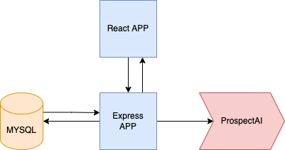
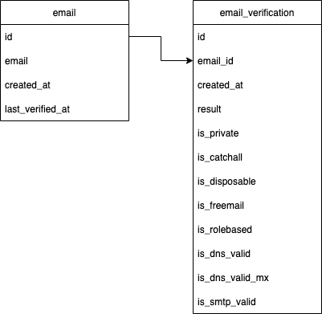
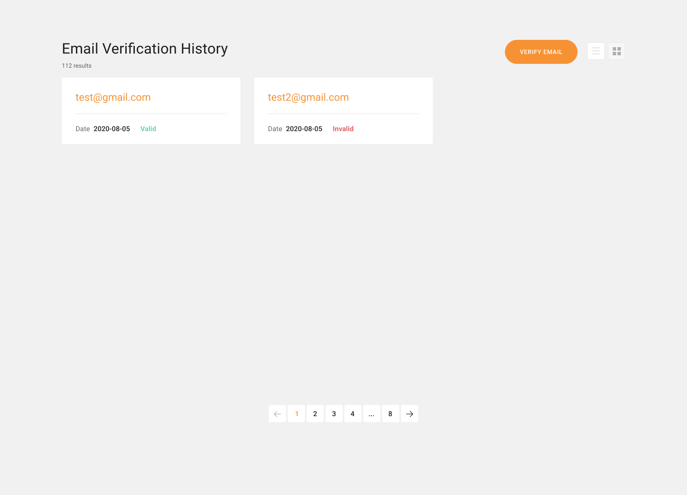
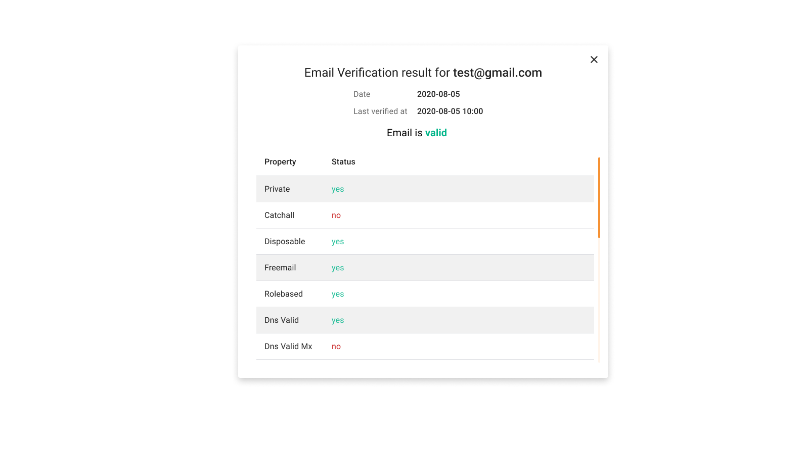
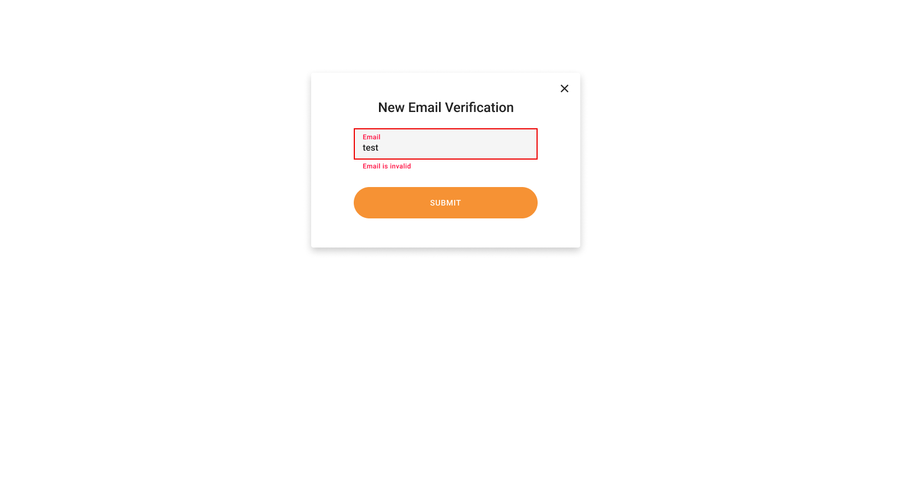

# Primarybyte Backend Node Interview

## Description
There are react frontend application with express backend application.

Express backend application relies on [ProspectAI API](https://apilabs.prospectai.com/docs#/paths/~1api~1v1~1email-verifier/post
) and designed to verify emails.
Backend provides two endpoints:
- GET `/email-verifications` - returns an email verification history.
- POST `/email-verifications` - sends new email to [ProspectAI API](https://apilabs.prospectai.com/docs#/paths/~1api~1v1~1email-verifier/post
  ).

All email verifications results stores to database available in docker stack.
The database schema consist of 2 tables: email and email_verification.

React frontend application allows customer:
* browse email verification history

* preview email verification details

* add verify new email

Application infrastructure is launching with docker-compose.yml: `docker-compose up -d`.
Postman Collection is available in [`./postman`](./postman/Email%20Verification%20Api.postman_collection.json) 

## Getting Started

### Installation
1. Copy `.env.example` > `.env`
2. Fill `PROSPECT_API_KEY`, `PROSPECT_BASE_URL` with given values.
3. Run `docker-compose up -d`

## Tasks
1. Save emails verification results to database.
2. Implement server-side validation for request `POST /email-verification`. Filter trash emails like `test@*`, `*@example.com`, `*@2x.png`.
3. Implement bulk processing on `POST /email-verification`.
4. Verify only new emails. Existing in DB emails return from DB.
5. Add redis cache to reduce load on MySQL.
6. Implement server side pagination on `GET /email-verification`.
7. Advanced: implement async processing on `POST:/email-verification` (ideas: queue, db & cron script, redis) 
